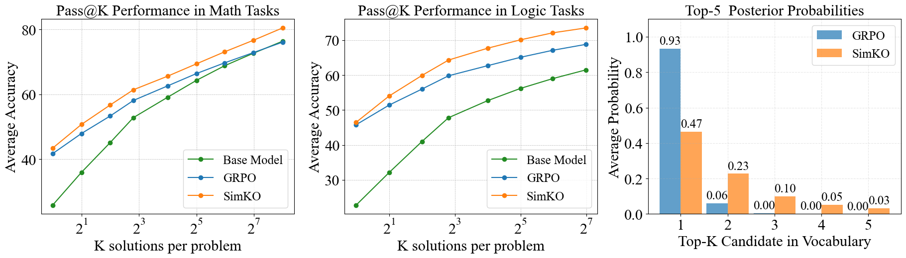

<div align="center">

# SimKO: Simple Pass@K Policy Optimization

[](https://arxiv.org/abs/2510.14807)

</div>


<div align="justify">
  
  <br>
  <sup><em>SimKO improves pass@K performance on math tasks  and logic tasks compared to GRPO, as shown in the plots (left and middle). The Figure on the right shows the k-th highest candidate probabilities averaged over the dataset. The SimKO-trained model exhibits a less concentrated probability distribution compared to GRPO.
</em></sup>
</div>

## Overview

In reinforcement learning with verifiable rewards (RLVR) for language models, a significant yet often overlooked challenge is **probability over-concentration**. Traditional methods (e.g., GRPO) tend to concentrate gradients on a small subset of candidate outputs, which limits the exploration of diverse, high-quality solutions and leads to degraded performance on pass@K benchmarks.

SimKO addresses this issue by employing an asymmetric approach. For verified-correct responses, it increases the probabilities of the top-K candidates, promoting a broader exploration of possible solutions. For verified-incorrect responses, SimKO applies stronger penalties to the top-1 candidate, discouraging over-concentration on incorrect paths. This asymmetric design is particularly effective at reducing over-concentration, especially at tokens with high entropy.
Across a variety of math and logical-reasoning benchmarks, SimKO consistently improves pass@K performance across different values of K, offering a straightforward method to enhance exploration in RLVR.

For a comprehensive explanation, check out our [paper](https://arxiv.org/abs/2510.14807).

## News
- **[2025/10/17]** We release our [paper](https://arxiv.org/abs/2510.14807) and code. 🚀
## Quick Start
### Installation


Start from a custom environment:
```
conda create -y -n verl python=3.10.14 && conda activate verl
pip install -e .
pip install vllm==0.8.2
pip install latex2sympy2
pip install fire
pip install tensordict==0.7.2
python -m pip install flash-attn --no-build-isolation
```


## Training
SimKO: specify `topk`, `mix_topk_coef`, `tau` and `simko` in `run_qwen2.5-math-7b_SimKO.sh` to train the model with SimKO.
```
bash run_qwen2.5-math-7b_SimKO.sh
```

GRPO
```
bash run_qwen2.5-math-7b_grpo.sh
```

## Acknowledgement
The code is based  on [RLVR-Decomposed](https://github.com/TianHongZXY/RLVR-Decomposed). 


## Citation

If you find our paper or code useful, please consider cite our work:

```bibtex
@article{peng2025simko,
    title={SimKO: Simple Pass@K Policy Optimization},
    author={Peng, Ruotian and Ren, Yi and Yu, Zhouliang and Liu, Weiyang and Wen, Yandong},
    journal={arXiv preprint arXiv:2510.14807},
    year={2025}
 }
```
